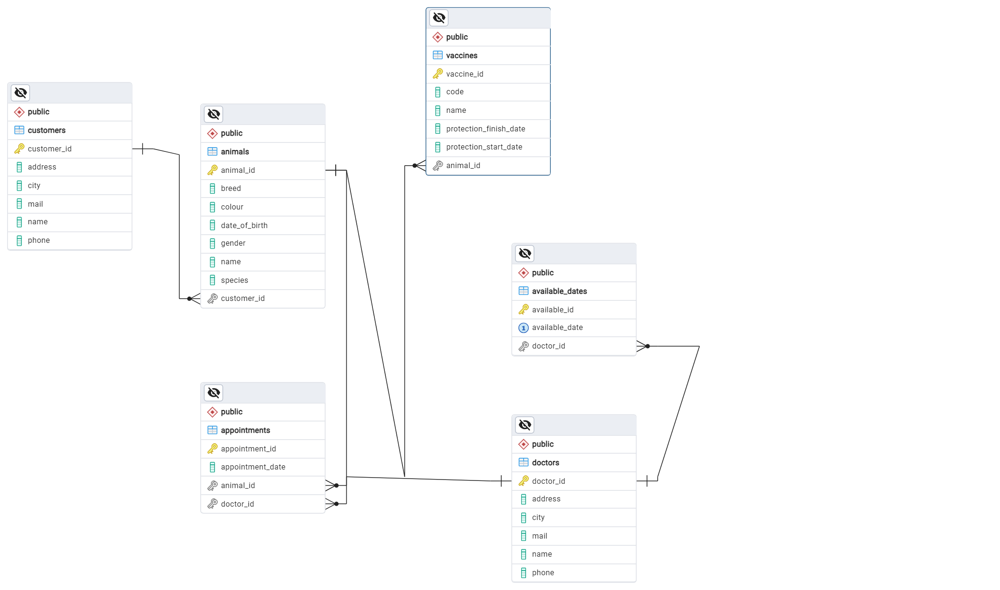
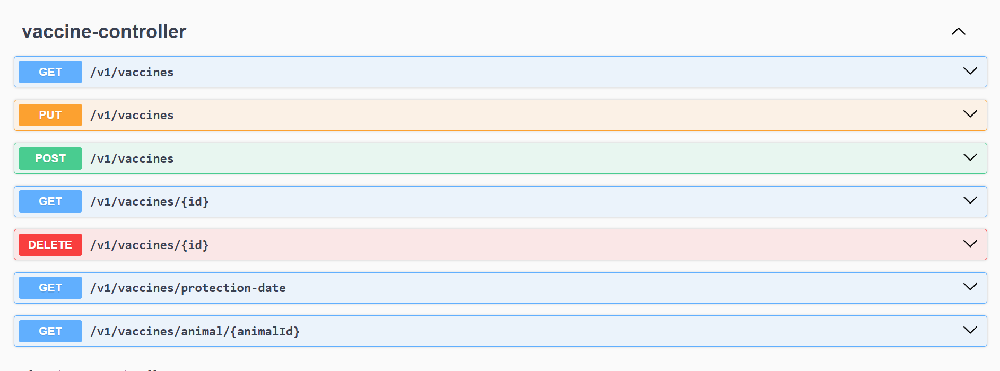
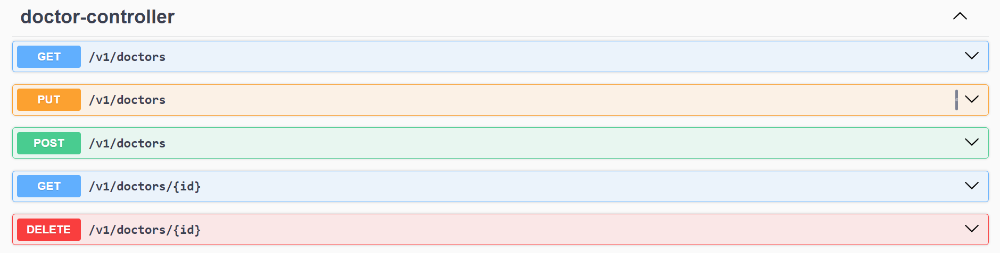
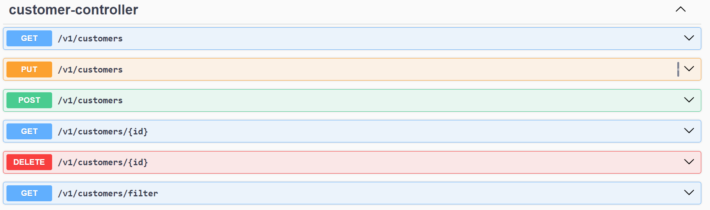
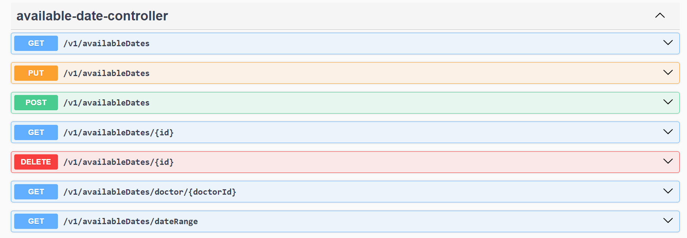
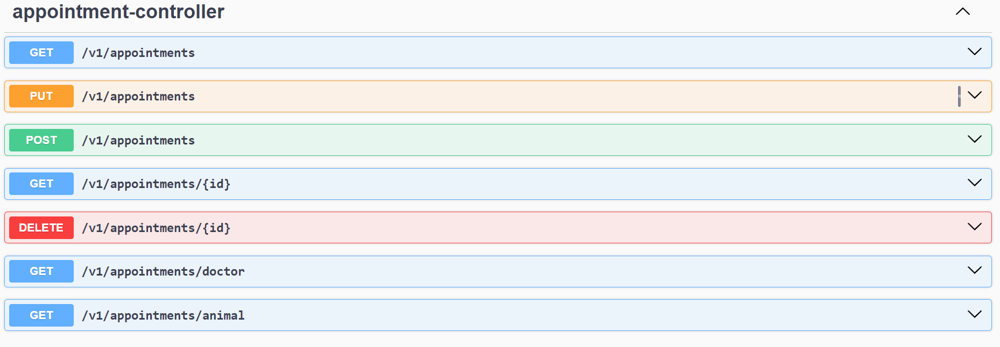
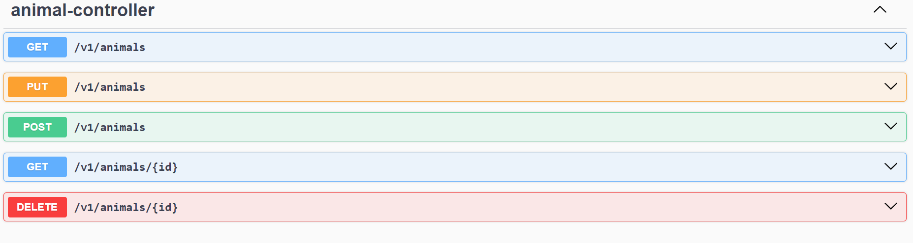

# Veteriner Yönetim Sistemi
Bu proje, bir veteriner kliniğinin işlerini yönetmek için geliştirilen bir API'dir. Proje kapsamında veteriner doktorlarının, müşterilerin, hayvanların, aşıların ve randevuların yönetimi sağlanacaktır. Uygulama katmanlı mimari ile geliştirilmiş olup, Spring Boot kullanılarak yazılmıştır. PostgreSQL veritabanı desteklenmektedir.

## UML Diyagramı

## Proje Özellikleri

### Hayvan Yönetimi

* Hayvanları kaydetme, güncelleme, görüntüleme ve silme
* Hayvanları isme göre filtreleme
* Bir müşteri için sisteme kayıtlı tüm hayvanları listeleme

### Müşteri Yönetimi

* Müşterileri kaydetme, güncelleme, görüntüleme ve silme
* Müşterileri isme göre filtreleme

### Aşı Yönetimi

* Hayvanlara uygulanan aşıları kaydetme, güncelleme, görüntüleme ve silme
* Aynı tip aşının koruyuculuk bitiş tarihi gelmeden yeni aşı kaydı yapılmasını engelleme
* Belirli bir hayvana ait tüm aşı kayıtlarını listeleme
* Aşı koruyuculuk bitiş tarihi yaklaşan hayvanları listeleme

### Randevu Yönetimi

* Hayvanların aşı ve muayene randevularının oluşturulması, güncellenmesi, görüntülenmesi ve silinmesi
* Randevu oluştururken doktorun müsait günleri ve saatleri kontrol edilerek çakışma olmadığında randevu oluşturma
* Randevuları tarih aralığına ve doktora göre filtreleme
* Randevuları tarih aralığına ve hayvana göre filtreleme

### Veteriner Doktor Yönetimi

* Veteriner doktorlarını kaydetme, güncelleme, görüntüleme ve silme
* Doktor Müsait Gün Yönetimi
* Doktorların müsait günlerini ekleme, güncelleme, görüntüleme ve silme

## Katmanlı Mimari

Proje, katmanlı mimari prensiplerine göre geliştirilmiştir. Temel katmanlar şunlardır:

* Controller: API isteklerini alır ve yanıtlar.
* Service: İş mantığını içerir.
* Repository: Veritabanı işlemlerini gerçekleştirir.
* Entity: Veritabanı tablolarını temsil eder.
* DTO: Veri transfer nesneleri.

## Kullanılan Teknolojiler ve Bağımlılıklar

* Spring Boot
* Spring Web
* Spring Data JPA
* PostgreSQL

## Gereksinimler

* JDK 11+
* Maven 3+
* PostgreSQL

## API Endpoints

## Hata Yönetimi

Projede anlamlı hata mesajları ve özel istisnalar kullanılmıştır. Örneğin:

* Kayıt zaten var ise: Kayıt sistemde mevcut.
* ID ile kayıt bulunamadığında: {id} id’li kayıt sistemde bulunamadı.
* Randevu oluşturma sırasında doktorun müsait günü yoksa: Doktor bu tarihte çalışmamaktadır!
* Randevu oluşturma sırasında saatte çakışma varsa: Girilen saatte başka bir randevu mevcuttur.

## Katkıda Bulunma

Projeye katkıda bulunmak isterseniz, lütfen bir pull request gönderin. Her türlü katkıya açığız.
